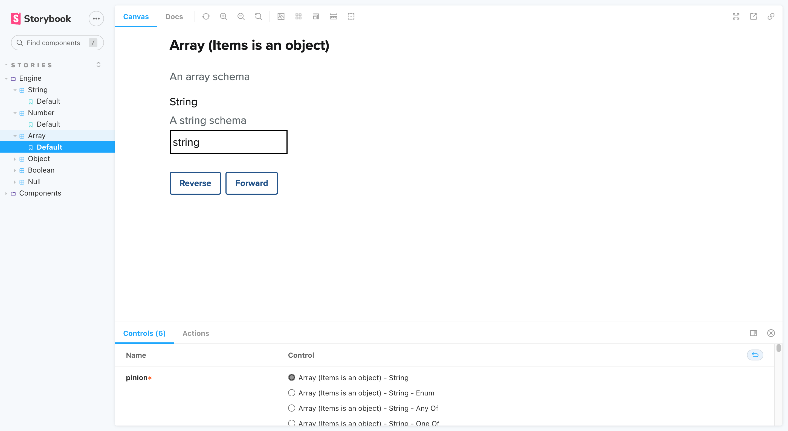
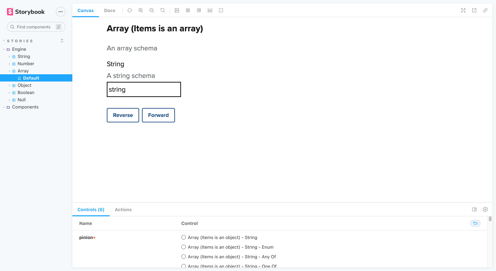

## 3. Array

Arrays contain _one_ or _several_ values, which can be any type (including other arrays). Our Stories contain _single-value_ layouts which you can explore under _Controls_.

Whether _items is an object_ or _items is an array_ depends on how Zashiki interprets the JSON Schema (assuming that Zashiki has mechanically translated a JSON Schema into a description, and the description hasn't been generated manually). It matters for validating the _document_ according to the _schema_, but for humans the distinction may seem arbitrary. Our stories account for both structures.

### Array (_Items is an object_)

- [String](#3---1---1-array-items-is-an-object---string)
- [String (_Enum_)](#3---1---1---1-array-items-is-an-object---string-enum)
- [String (_Any of_)](#3---1---1---2-array-items-is-an-object---string-any-of)
- [String (_One of_)](#3---1---1---3-array-items-is-an-object---string-one-of)
- [Number](#3---1---2-array-items-is-an-object---number)
- [Number (_Enum_)](#3---1---2---1-array-items-is-an-object---number-enum)
- [Number (_Any of_)](#3---1---2---2-array-items-is-an-object---number-any-of)
- [Number (_One of_)](#3---1---2---3-array-items-is-an-object---number-one-of)
- [Boolean](#3---1---3-array-items-is-an-object---boolean)
- [Boolean (_Enum_)](#3---1---3---1-array-items-is-an-object---boolean-enum)
- [Boolean (_Any of_)](#3---1---3---2-array-items-is-an-object---boolean-any-of)
- [Boolean (_One of_)](#3---1---3---3-array-items-is-an-object---boolean-one-of)
- [Null](#3---1---4-array-items-is-an-object---null)
- [Null (_Enum_)](#3---1---4---1-array-items-is-an-object---null-enum)
- [Null (_Any of_)](#3---1---4---2-array-items-is-an-object---null-any-of)
- [Null (_One of_)](#3---1---4---3-array-items-is-an-object---null-one-of)

### Array (_Items is an array_)

- [String](#3---2---1-array-items-is-an-array---string)
- [String (_Enum_)](#3---2---1---1-array-items-is-an-array---string-enum)
- [String (_Any of_)](#3---2---1---2-array-items-is-an-array---string-any-of)
- [String (_One of_)](#3---2---1---3-array-items-is-an-array---string-one-of)
- [Number](#3---2---2-array-items-is-an-array---number)
- [Number (_Enum_)](#3---2---2---1-array-items-is-an-array---number-enum)
- [Number (_Any of_)](#3---2---2---2-array-items-is-an-array---number-any-of)
- [Number (_One of_)](#3---2---2---3-array-items-is-an-array---number-one-of)
- [Boolean](#3---2---3-array-items-is-an-array---boolean)
- [Boolean (_Enum_)](#3---2---3---1-array-items-is-an-array---boolean-enum)
- [Boolean (_Any of_)](#3---2---3---2-array-items-is-an-array---boolean-any-of)
- [Boolean (_One of_)](#3---2---3---3-array-items-is-an-array---boolean-one-of)
- [Null](#3---2---4-array-items-is-an-array---null)
- [Null (_Enum_)](#3---2---4---1-array-items-is-an-array---null-enum)
- [Null (_Any of_)](#3---2---4---2-array-items-is-an-array---null-any-of)
- [Null (_One of_)](#3---2---4---3-array-items-is-an-array---null-one-of)

### 3 - 1 - 1. Array (_Items is an object_) - String

_Back to [Array](#3-array)_

### 3 - 1 - 1 - 1. Array (_Items is an object_) - String (_Enum_)

_Back to [Array](#3-array)_

### 3 - 1 - 1 - 2. Array (_Items is an object_) - String (_Any Of_)

_Back to [Array](#3-array)_

### 3 - 1 - 1 - 3. Array (_Items is an object_) - String (_One Of_)

### 3 - 1 - 2. Array (_Items is an object_) - Number

_Back to [Array](#3-array)_

### 3 - 1 - 2 - 1. Array (_Items is an object_) - Number (_Enum_)

_Back to [Array](#3-array)_

### 3 - 1 - 2 - 2. Array (_Items is an object_) - Number (_Any Of_)

_Back to [Array](#3-array)_

### 3 - 1 - 2 - 3. Array (_Items is an object_) - Number (_One Of_)

_Back to [Array](#3-array)_

### 3 - 1 - 3. Array (_Items is an object_) - Boolean

_Back to [Array](#3-array)_

### 3 - 1 - 3 - 1. Array (_Items is an object_) - Boolean (_Enum_)

_Back to [Array](#3-array)_

### 3 - 1 - 3 - 2. Array (_Items is an object_) - Boolean (_Any Of_)

_Back to [Array](#3-array)_

### 3 - 1 - 3 - 3. Array (_Items is an object_) - Boolean (_One Of_)

_Back to [Array](#3-array)_

### 3 - 1 - 4. Array (_Items is an object_) - Null

_Back to [Array](#3-array)_

### 3 - 1 - 4 - 1. Array (_Items is an object_) - Null (_Enum_)

_Back to [Array](#3-array)_

### 3 - 1 - 4 - 2. Array (_Items is an object_) - Null (_Any Of_)

_Back to [Array](#3-array)_

### 3 - 1 - 4 - 3. Array (_Items is an object_) - Null (_One Of_)

_Back to [Array](#3-array)_

### 3 - 2 - 1. Array (_Items is an array_) - String

_Back to [Array](#3-array)_

### 3 - 2 - 1 - 1. Array (_Items is an array_) - String (_Enum_)

_Back to [Array](#3-array)_

### 3 - 2 - 1 - 2. Array (_Items is an array_) - String (_Any Of_)

_Back to [Array](#3-array)_

### 3 - 2 - 1 - 3. Array (_Items is an array_) - String (_One Of_)

### 3 - 2 - 2. Array (_Items is an array_) - Number

_Back to [Array](#3-array)_

### 3 - 2 - 2 - 1. Array (_Items is an array_) - Number (_Enum_)

_Back to [Array](#3-array)_

### 3 - 2 - 2 - 2. Array (_Items is an array_) - Number (_Any Of_)

_Back to [Array](#3-array)_

### 3 - 2 - 2 - 3. Array (_Items is an array_) - Number (_One Of_)

_Back to [Array](#3-array)_

### 3 - 2 - 3. Array (_Items is an array_) - Boolean

_Back to [Array](#3-array)_

### 3 - 2 - 3 - 1. Array (_Items is an array_) - Boolean (_Enum_)

_Back to [Array](#3-array)_

### 3 - 2 - 3 - 2. Array (_Items is an array_) - Boolean (_Any Of_)

_Back to [Array](#3-array)_

### 3 - 2 - 3 - 3. Array (_Items is an array_) - Boolean (_One Of_)

_Back to [Array](#3-array)_

### 3 - 2 - 4. Array (_Items is an array_) - Null

_Back to [Array](#3-array)_

### 3 - 2 - 4 - 1. Array (_Items is an array_) - Null (_Enum_)

_Back to [Array](#3-array)_

### 3 - 2 - 4 - 2. Array (_Items is an array_) - Null (_Any Of_)

_Back to [Array](#3-array)_

### 3 - 2 - 4 - 3. Array (_Items is an array_) - Null (_One Of_)

_Back to [Array](#3-array)_
