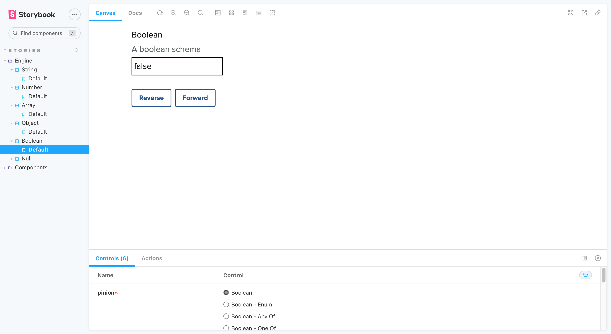

## 5. Boolean

- [Boolean (_Enum_)](#5---1-boolean-enum)
- [Boolean (_Any of_)](#5---2-boolean-any-of)
- [Boolean (_One of_)](#5---3-boolean-one-of)

### 5 - 1. Boolean (_Enum_)

_Back to [Boolean](#5-boolean)_

### 5 - 2. Boolean (_Any Of_)

_Back to [Boolean](#5-boolean)_

### 5 - 3. Boolean (_One Of_)

_Back to [Boolean](#5-boolean)_
