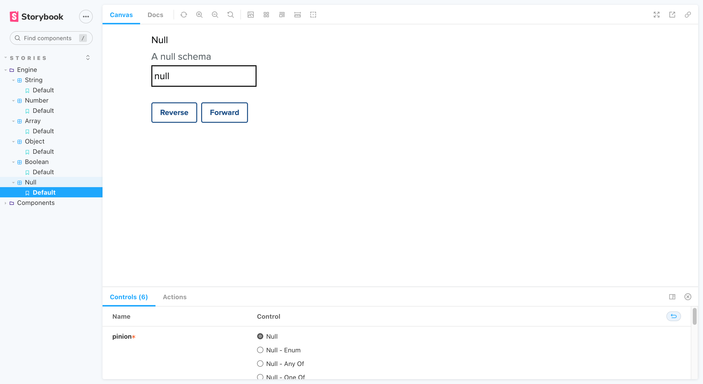

## 6. Null

- [Null (_Enum_)](#6---1-null-enum)
- [Null (_Any of_)](#6---2-null-any-of)
- [Null (_One of_)](#6---3-null-one-of)

### 6 - 1. Null (_Enum_)

_Back to [Null](#6-null)_

### 6 - 2. Null (_Any Of_)

_Back to [Null](#6-null)_

### 6 - 3. Null (_One Of_)

_Back to [Null](#6-null)_
