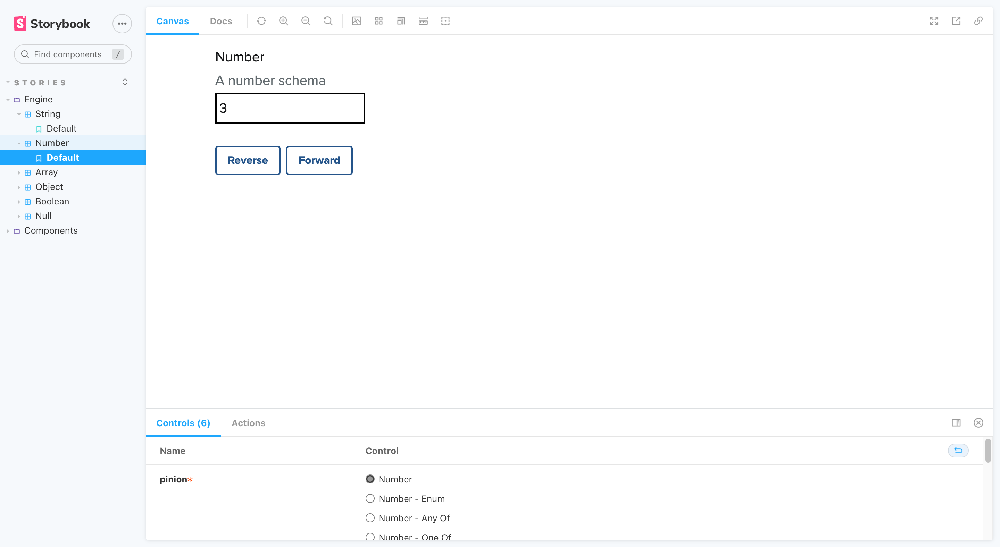

## 2. Number

- [Number (_Enum_)](#2---1-number-enum)
- [Number (_Any of_)](#2---2-number-any-of)
- [Number (_One of_)](#2---3-number-one-of)

### 2 - 1. Number (_Enum_)

_Back to [Number](#2-number)_

### 2 - 2. Number (_Any Of_)

_Back to [Number](#2-number)_

### 2 - 3. Number (_One Of_)

_Back to [Number](#2-number)_
