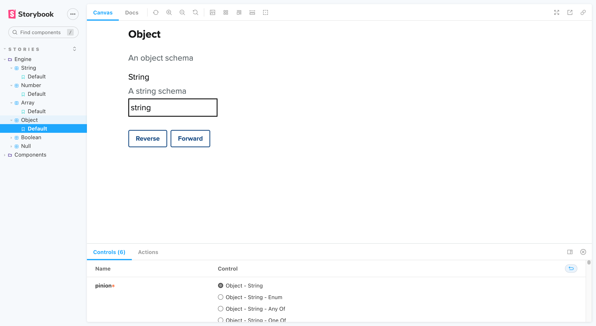
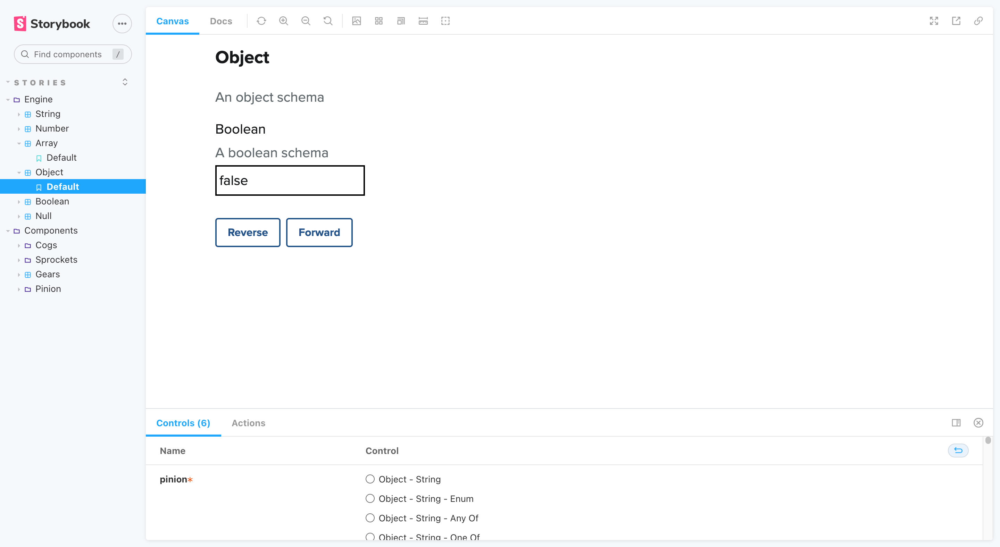
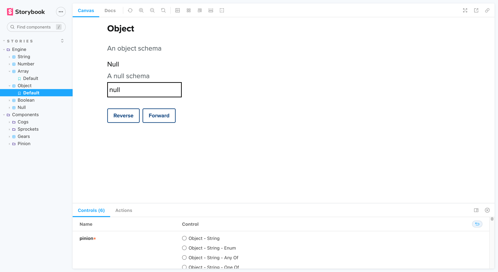

## 4. Object

Objects contain _one_ or _several_ values, which can be any type (including other objects). Our Stories contain _single-value_ layouts which you can explore under _Controls_.

- [Object - String](#4---1-object---string)
- [Object - String (_Enum_)](#4---1---1-object---string-enum)
- [Object - String (_Any of_)](#4---1---2-object---string-any-of)
- [Object - String (_One of_)](#4---1---3-object---string-one-of)
- [Object - Number](#4---2-object---number)
- [Object - Number (_Enum_)](#4---2---1-object---number-enum)
- [Object - Number (_Any of_)](#4---2---2-object---number-any-of)
- [Object - Number (_One of_)](#4---2---3-object---number-one-of)
- [Object - Boolean](#4---3-object---boolean)
- [Object - Boolean (_Enum_)](#4---3---1-object---boolean-enum)
- [Object - Boolean (_Any of_)](#4---3---2-object---boolean-any-of)
- [Object - Boolean (_One of_)](#4---3---3-object---boolean-one-of)
- [Object - Null](#4---4-object---null)
- [Object - Null (_Enum_)](#4---4---1-object---null-enum)
- [Object - Null (_Any of_)](#4---4---2-object---null-any-of)
- [Object - Null (_One of_)](#4---4---3-object---null-one-of)

### 4 - 1. Object - String

_Back to [Object](#4-object)_

### 4 - 1 - 1. Object - String (_Enum_)

_Back to [Object](#4-object)_

### 4 - 1 - 2. Object - String (_Any Of_)

_Back to [Object](#4-object)_

### 4 - 1 - 3. Object - String (_One Of_)

_Back to [Object](#4-object)_

### 4 - 2. Object - Number

_Back to [Object](#4-object)_

### 4 - 2 - 1. Object - Number (_Enum_)

_Back to [Object](#4-object)_

### 4 - 2 - 2. Object - Number (_Any Of_)

_Back to [Object](#4-object)_

### 4 - 2 - 3. Object - Number (_One Of_)

_Back to [Object](#4-object)_

### 4 - 3. Object - Boolean

_Back to [Object](#4-object)_

### 4 - 3 - 1. Object - Boolean (_Enum_)

_Back to [Object](#4-object)_

### 4 - 3 - 2. Object - Boolean (_Any Of_)

_Back to [Object](#4-object)_

### 4 - 3 - 3. Object - Boolean (_One Of_)

_Back to [Object](#4-object)_

### 4 - 4. Object - Null

_Back to [Object](#4-object)_

### 4 - 4 - 1. Object - Null (_Enum_)

_Back to [Object](#4-object)_

### 4 - 4 - 2. Object - Null (_Any Of_)

_Back to [Object](#4-object)_

### 4 - 4 - 3. Object - Null (_One Of_)

_Back to [Object](#4-object)_
