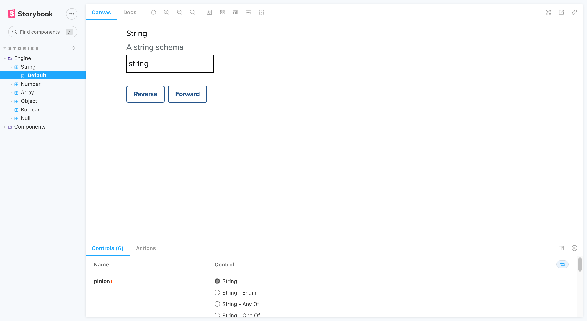

## 1. String

- [String (_Enum_)](#1---1-string-enum)
- [String (_Any of_)](#1---2-string-any-of)
- [String (_One of_)](#1---3-string-one-of)

### 1 - 1. String (_Enum_)

_Back to [String](#1-string)_

### 1 - 2. String (_Any Of_)

_Back to [String](#1-string)_

### 1 - 3. String (_One Of_)

_Back to [String](#1-string)_
